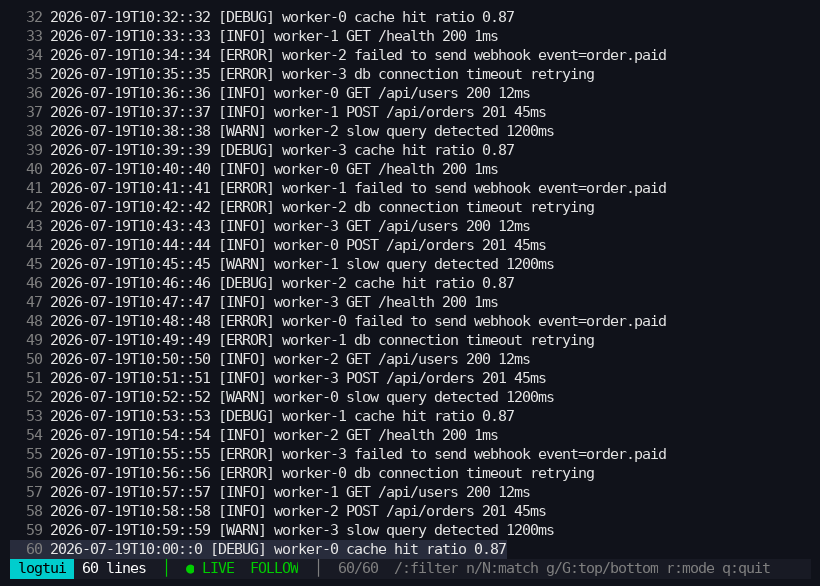
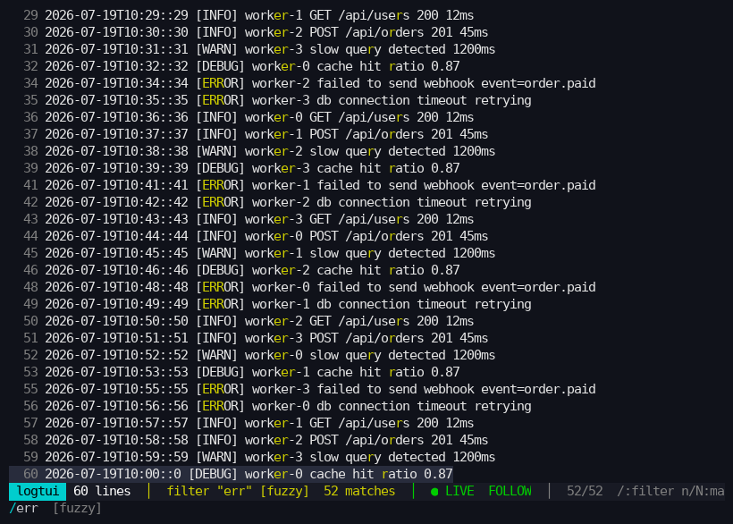
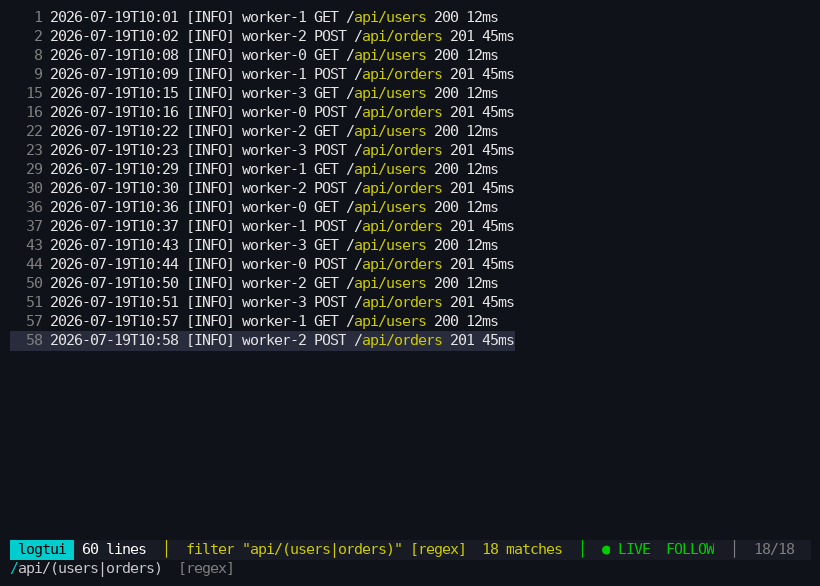

# logtui

Pipe any command's output into an interactive TUI viewer. Input is treated as
**opaque lines of text** — no log-format or timestamp assumptions.

```sh
docker compose logs -f web | logtui
cat bigfile.log            | logtui
find / -name "*.rs"        | logtui
journalctl -f              | logtui --regex
```

Works with **finite input** (`cat`, `find` — reads to EOF, then you browse a
static view) and **infinite streams** (`tail -f` — auto-follows new lines).

## Screenshots

| Follow mode (live stream) | Fuzzy filter `err` | Regex `api/(users\|orders)` |
| --- | --- | --- |
|  |  |  |

## Features

- **Responsive under load** — a dedicated reader thread pumps stdin into a
  bounded channel; the UI drains it on a ~30 fps tick and never blocks on I/O.
- **Capped ring buffer** (default 10,000 lines, `--buffer-size N`) — memory
  stays bounded no matter how long the stream runs; the status bar reports how
  many lines were dropped. The same cap applies to finite input, consistently.
- **Follow mode** — auto-scrolls to the newest line until you scroll up;
  `G` (or scrolling back to the bottom) resumes. `--no-follow` starts parked
  at the top even while input is still streaming.
- **Live filter** — `/` opens the search bar and filters as you type:
  - *fuzzy* (default, subsequence matching via `fuzzy-matcher`, smart-case)
  - *regex* (`--regex` to start there, `r` / `Ctrl-r` to toggle)
  - *substring fallback* — an invalid regex degrades to a literal substring
    match instead of showing nothing
- **Match highlighting** — the exact matched characters are highlighted in
  every visible line (fuzzy char positions, substring spans, or regex spans).
- **Filtering is a view** — the buffer is never mutated; `Esc` restores the
  full stream instantly, and lines arriving while a filter is active are
  matched live. The view stores stable absolute line numbers, so it stays
  correct even as the ring buffer evicts old lines.
- **Status bar** — buffered/dropped line counts, active filter + mode, match
  count, `● LIVE` vs `■ EOF` input state, follow indicator, position.
- **Graceful terminal handling** — raw mode + alternate screen restored on
  quit *and* on panic; resize just works; clear error if there's no
  controlling terminal.

## Keybindings

| Key | Action |
| --- | --- |
| `j` / `k` / `↑` / `↓` | scroll one line |
| `PageUp` / `PageDown`, `Ctrl-u` / `Ctrl-d` | page / half-page |
| `g` / `G` (or `Home` / `End`) | jump to top / bottom (`G` resumes follow) |
| `/` | open search bar (filters in real time) |
| `Enter` | confirm filter, back to scroll mode |
| `Esc` | clear filter / close search bar |
| `n` / `N` | next / previous match (wraps) |
| `r` | toggle fuzzy ⇄ regex (`Ctrl-r` inside the search bar) |
| `h` / `l` / `←` / `→` | horizontal scroll for long lines |
| mouse wheel | scroll |
| `q` / `Ctrl-c` | quit |

## CLI flags

```
--buffer-size <N>   ring buffer capacity (max lines in memory) [default: 10000]
--no-follow         don't auto-scroll; start at the top and stay put
--regex             start in regex filter mode instead of fuzzy
```

## Architecture

```
stdin ──▶ reader thread ──▶ bounded crossbeam channel ──▶ UI thread
              (blocking I/O)        (backpressure)            │
                                                              ▼
   ratatui render  ◀──  App state  ◀──  RingBuffer (capped, stable abs numbers)
   (ui.rs)                    (app.rs)        (buffer.rs)
                                   │
                                   ▼
                          Filter view — Vec<abs line numbers>
                          fuzzy / substring / regex (filter.rs)
```

- `reader.rs` — stdin reader thread, sends `Line` / `Eof` messages.
- `buffer.rs` — `RingBuffer` with eviction counting and absolute numbering.
- `filter.rs` — `Filter` (compiled per query/mode) → highlight char indices.
- `app.rs` — state machine: view, selection, follow, keybindings.
- `ui.rs` — ratatui rendering (gutter, highlight, status/search bars).
- `main.rs` — clap CLI, terminal setup/teardown, ~30 fps event loop.

## Build & test

```sh
cargo build --release        # binary: target/release/logtui
cargo test                   # unit tests (buffer, filter, app state machine)
python3 tests/pty_harness.py # integration: drives the real binary in a pty
```
